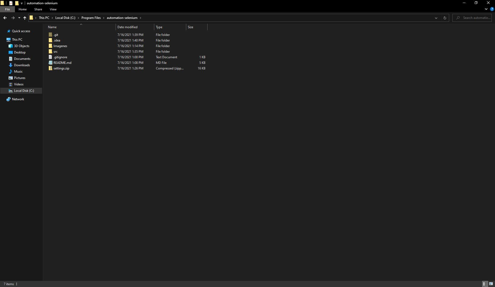
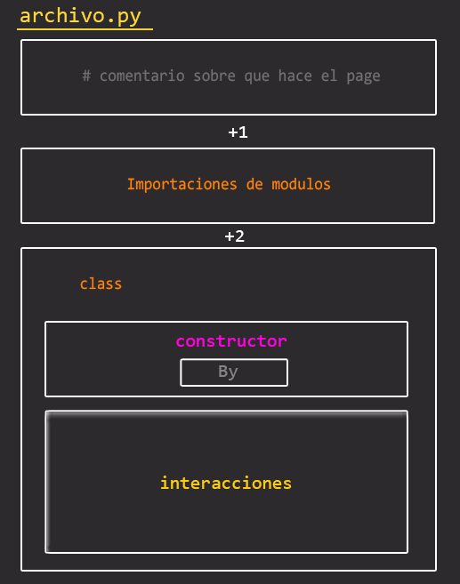
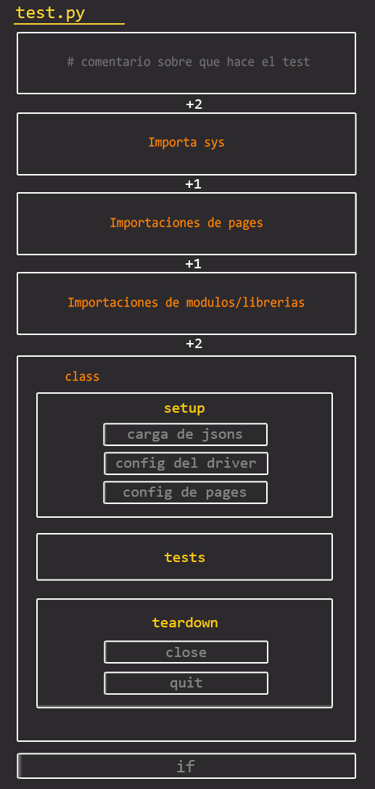

## Mis configuraciones al hacer testing

#### INSTALACION y CONFIGURACION DE CARPETAS
##### IDE y Programas necesarios:
- [Python](https://www.python.org/downloads/ "Python"): Instalar la version 3.6, en el instalador marcar la casilla 'add to path'.
- [Git](https://git-scm.com/ "esta pagina"): Controlador de versiones. 
- [Pycharm](https://www.jetbrains.com/pycharm/download/#section=windows "Pycharm"): IDE, instalar la version comunity.

#### Que sigue:
Parados en `C:/Program Files/` ejecutar el comando desde git bash `git clone [url del proyecto]`.

Si no hubo ningun problema ejecutar el comando `ls` para poder ver las carpetas clonadas, navegar de forma manual a `C:\Program Files\automation-selenium\src`. 
Deberian estar las siguientes carpetas o algo similar:


### TIPS
Si queremos skipear algun archivo en particular o archivos con cierto tipo de extensiones para no pushearlo, navegar hacia el mismo nivel que la carpeta `.git` y crear un archivo `.gitignore` (si ya esta creada no hace falta, simplemente agregale lo que necesites), dentro del mismo tenemos estas posibilidades:
```
archivo.extension // Para poder skipear algun archivo en particular
*.extension // Para skipear todos los archivos con cierta extension
```
Para ver mas comandos de git visita [esta pagina](https://www.hostinger.com/tutorials/basic-git-commands "esta pagina").
### CONFIG DEL PROYECTO
Parados en la carpeta `src` abrir CMD y ejecutar el comando `pip install selenium`
> **pip** es un sistema de gestión de paquetes utilizado para instalar y administrar paquetes de software escritos en Python. Muchos paquetes pueden ser encontrados en el Python Package Index ([PyPI](https://pypi.org/ "PyPI")).

> **Selenium** es un entorno de pruebas de software para aplicaciones basadas en la web.

Una vez ejecutado los comandos ya podriamos arrancar con el proyecto.
Si la consola no ejecuta el comando de `pip install selenium` se tiene que actualizar `pip`, configurar el interprete y agregar al path el driver.
1. Para actualizar `pip` es necesario seguir la guia que lanza la consola, ya que la ruta y el comando de instalacion no siempre es el mismo.

2. El interprete se configura desde el IDE (Pycharm) yendo a `Settings > Project > python interpreter`, ahi mismo tambien se puede actualizar `selenium` o `pip` de forma visual, si se complica desde la consola CMD.

3. Para agregar el ChromeDriver al path apretar el boton `Win` de su teclado luego escribir "path" y dale enter, vamos a `enviroment variables` > clickeamos sobre Path > `edit` > `new` > y le pegamos la siguiente URL: `C:\Program Files\automation-selenium\src\chromedriver.exe` > le damos a todo **OK**.

Listo ya tendriamos configurado todo para comenzar!.
### MODULOS / LIBRERIAS 
Las siguientes son los que por lo general se van a necesitar/usar en la creacion de tests o pages en este proyecto.
#### Page Objects:
- By (arma tuplas)
- EC (condiciones esperadas)
- WebdriverWait (espera implicita)
- Select (para opciones desplazables)
#### Tests:
- Options (start-maximized || headless)
- Webdriver (para localizar el chromedriver)
- Unittest (ofrece la posibilidad de crear las pruebas en el propio código)
- Json (formato ligero de intercambio de datos)

### SEMANTICA DE ARCHIVOS
####TEMPLATES:
Para crear rapidamente un template para el archivo de test o el archivo de page seguir los siguientes pasos:
- Abrir Pycharm, ir a `File` > `Manage IDE Settings` > `Import Settings...` > pegar la siguiente ruta: `C:\Program Files\automation-selenium\settings.zip`.

  
- Dentro de un archivo vacio con extension `.py` que sea para test escribir `testing`, luego apretar `tab` para poder crear el template.

  
- Dentro de un archivo vacio con extension `.py` que sea para PageObject escribir `pageobj`, luego apretar `tab` para poder crear el template.
##### Organizacion de los Page

##### Organizacion de los Tests

------------
#### CONVENCION DE CODIGO
- Despues de los imports dejamos 2 lineas de espacios entre la misma y la `class`
- Cuando vamos a darle el nombre a clases usar camelCase
- Cuando creamos los metodos del page se usa snake_case, al principio del nombre especificar el uso del mismo, si el metodo clickea un boton entonces el nombre seria algo parecido a: `def click_elemento_n(self):`
- **SIEMPRE** al principio de un metodo que sea test tiene que inicializar como `test`  ejemplo:
`def test_ejemplo_verificar(self):`
- Afuera de la clase de los test poner siempre:
`if __name__ == "__main__":` `unittest.main()`
